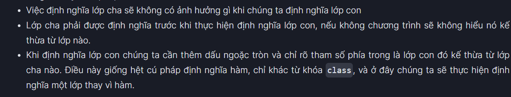
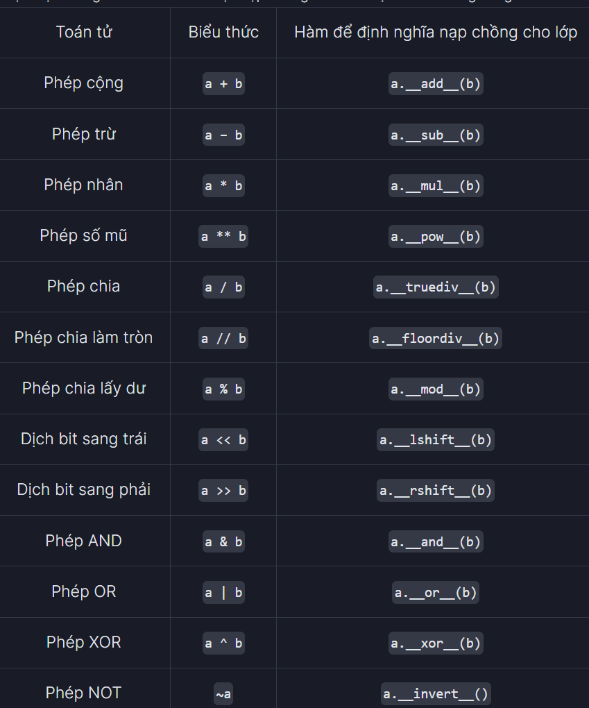
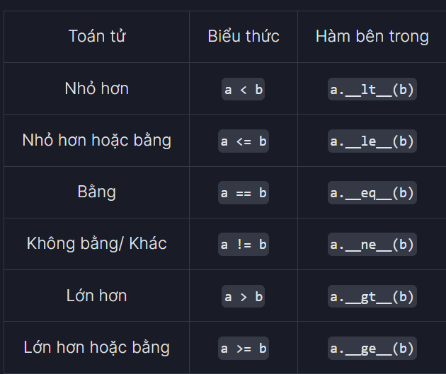
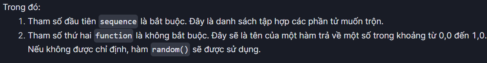

# Python syntax
## Variable and basic data type in Python
- **Variable** like other program's languages, variables' names in Python must follow several rules\:
  - The 1st letter is alpha (a,b,A,B,...)
  - Do not contain space
  - Not be key words in Python\:
    
  - Do not use special letter (!, @, #, $, ...)
  - Should clearly represent the purpose
- **Data type**\: int, float, str, bool, complex
  - To determine what kind of data type of a variable is, using `type()` function\:
    ```Python
    a = 100
    print(type(a))              # int
    ```
- **Operator\:**
  - **Comparator operator\:**
    
  - **Note\:** When comparing 2 float numbers, **SHOULD NOT** use the `==` operator. Instead, using a small enough number as the comparator
  - **Logic Comparator\:**
    
- **Assignment**\:

## String
### Basic syntax\:
- To create a string, put it into a `""` or `''`
- To include multiple lines in the string use `""" """`
For example\:
```Python
a = 'Python'               
print(a)                        # Python
a = "Python"
print(a)                        # Python
a = '''Python'''
print(a)                        # Python
a = """Python, Lập trình
           Python"""
print(a)                        # Python, Lập trình
                                # Python
```
### Combine strings
- Using `+` operator\: 
```Python
a = "Python"
b = "is easy"
print(a + b)                    # Python is easy
```
- Using `*` operator\:
```Python
a = "Python"
print(a * 3)                    # PythonPythonPython
```
- Using parentheses `()`\:
```Python
a = 'Python ''Javascript'
b = ('Python '
            'Java')
print(a)                        # Python Javascript
print(b)                        # Python Java
```
- Using `join()` method\: `separator_string.join(iterable)`
  ```Python
  # .join() with lists
  numList = ['1', '2', '3', '4']
  separator = ', '
  print(separator.join(numList)) #1, 2, 3, 4
  # join elements of text with space
  text = ['Python', 'is', 'a', 'great', 'programming', 'language']
  print(' '.join(text))          #Python is a great programming language

  #join string
  s1 = 'abc'
  s2 = '123'
  # each element of s2 is separated by s1
  print('s1.join(s2):', s1.join(s2))        #s1.join(s2): 1abc2abc3
  # each element of s1 is separated by s2
  print('s2.join(s1):', s2.join(s1))        #s2.join(s1): a123b123c
  ```
### Input() function
```Python
name = input("Enter your name: ")
print(name)                     # Enter your name: 

```
### Element's accessment in string
- String uses index just like list()
- For example\:
```Python
a = "Python TEK4.VN"
print(a)                        #Python TEK4.VN
print(a[2])                     #t
print(a[-1])                    #N
```
### Substring
- Similar with sublist\:`str[start:end:step]`
  ```Python
  my_string = "Python is easy"
  a1=my_string[0:3] 
  a2=my_string[2:-2] 
  print(a1)                     #Pyt
  print(a2)                     #thon is ea
  ```
- Using `split(separator, maxsplit)` to divide the string into a list including `maxsplit` elements separated by `separator` 
  ```Python
  text= 'I love Python'
  print(text.split()) #split with " " separator

  number_string = '1, 2, 3, 4, 5'
  print(number_string.split(', ')) #split with ', ' separator
  print(number_string.split(':')) #split with ':' separator
  print(number_string.split(', ', 2)) # maxsplit: 2
  ```
  Result:\:
  ```Python
  ['I', 'love', 'Python']
  ['1', '2', '3', '4', '5']
  ['1, 2, 3, 4, 5']
  ['1', '2', '3, 4, 5']
  ```
- Using `len()` to calculate the string length
- Using `in` or `not in` to check if an element is in the string
### Change a string
- Using `replace(a, b)` to replace a by b
- Using `del a` to delete a completely
- Using `strip(a)`, `rstrip(a)` and `lstrip(a)` to eliminate `a` from both ends, right and left of the string respectively
- Using `print(*object, sep = ' ', end = '\n', file = sys.stdout, flush = False)` as advanced print method
- **`f_string` method**\:
  ```Python
  name = "tek.vn"
  name2 = "Python"
  print(f"{name2} is easy to learn with {name}!")   # Python is easy to learn with tek.vn!
  ```
### Format specifiers
```Python
a = 100.375
print('%.3f' %a)
print('%.5f' %a)
```
Result\:
```Python
100.375
100.37500
```


- Using `format()` method\:`string.format(value1, value2,...)`
  
  
  ```Python
  print("{:5d}".format(19))
  print("{:2d}".format(3291))
  print("{:8.3f}".format(19.9813219))
  print("{:05d}".format(21))
  print("{:08.3f}".format(10.438292189))
  ```
  Result\:
  ```Python
    19
  3291
    19.981
  00021
  0010.438
  ```
## Structure in Python
### if...else and if... elif...else
```Python
a = int(input("Enter a number:"))
if a == 0:
    print("Zero")
elif a > 0:
    print(f"{a} is a positive number")
else:
    print("Negative number")
```
### Iteration in Python
- **For loop**\: `for i in collection:`
  - Example\:
    ```Python
    sinh_vien = ["Sinh viên trường Y", "Sinh viên trường Luật", "Sinh viên trường Kỹ thuật"]
    for sv in sinh_vien:
      print(sv)               #Sinh viên trường Y
                              #Sinh viên trường Luật
                              #Sinh viên trường Kỹ thuật
    ```
  - Using `range(start, stop, step)`
    ```Python
    for x in range(1, 4, 2):
      print(x)                #1
                              #3
    ```
- **while loop**\: similarly
## List in Python
- **Initialization\:**
  - Using `list()` function
  - Using `[]`
    ```Python
    my_list1 = list((1, 2, 3))
    print(my_list1)             # [1, 2, 3]
    my_list2 = [1, 2, 3]
    print(my_list2)             # [1, 2, 3]

    my_list3 = [300, "Python", 500.5]
    print(my_list3)             # [300, 'Python', 500.5]

    my_list4 = list()
    print(my_list4)             # []
    vi_du = []
    print(vi_du)                # []
    ```
- The length of list\: Using `len()` function
```Python
my_list = [100, 200, "Python"]
print(len(my_list))             # 3
```
- **Index accessment**
  
- **List slicing**\: general case `listname[start_index : end_index : step]`
  - None of those parameters is mandatory
  - For example\:
    ```Python
    vidu_list=[0, 1, 2, 3, 4, 5, 6, 7, 8, 9]
    print(vidu_list[2:6:2])     # [2, 4]
    print(vidu_list[0:8:3])     # [0, 3, 6]
    print(vidu_list[:5:2])      # [0, 2, 4]
    print(vidu_list[:5:-2])     # [9, 7]
    print(vidu_list[5::2])      # [5, 7, 9]
    print(vidu_list[5::-2])     # [5, 3, 1]
    print(vidu_list[::2])       # [0, 2, 4, 6]
    print(vidu_list[::-2])      # [9, 7, 5, 3, 1]
    print(vidu_list[::])        # [0, 1, 2, 3, 4, 5, 6, 7, 8, 9]
    print(vidu_list[:5])        # [0, 1, 2, 3, 4]
    print(vidu_list[5:])        # [5, 6, 7, 8, 9]
    ```
- **Change list's elements**
  ```Python
    vi_du2 = [50, 100, 200, 300, 400]
    print(vi_du2)               # [50, 100, 200, 300, 400]
    vi_du2[4] = 500
    print(vi_du2)               # [50, 100, 200, 300, 500]
    vi_du2[0:2] = [90, 150]
    print(vi_du2)               # [90, 150, 200, 300, 500]
  ```
- **Add list's elements**
  - Using `+` operator\: connect 2 or more lists
  - Using `append(a)` to add `a` to the tail of the list
  - Using `insert(position, value)` to add `value` to the specified position
  - Using `extend(a, b, c,...)` to add multiple value to the tail of the list
- **Eliminate list's elements**
  
- **Find element in list**
  - `in`\: if an element is in the list, it return true, else false
  - `not in`\: if an element is not in the list, it return true, else false
- **Sort**\: `list.sort(key=..., reverse=...)`
  - `key`\: a particular sorting function
  - `reverse = True`\: descendent sort
  - `reverse = False`\: ascendent sort
- **Reverse**\: `mylist.reverse()`
- **Max/min in list**\:`max(list)` and `min(list)`
- **Sum of list**\: `sum(list)`
- **Count element's apppearance**\: `list.count(a)`
- **Copy list**\:
  - Using assignment\: 
   ```Python
    my_list1 = [1, 2, 3]
    new_list = my_list1

    print(new_list)             # [1, 2, 3]
    my_list1.append(4)
    print(my_list1)             # [1, 2, 3, 4]
    print(new_list)             # [1, 2, 3, 4]
   ```
  - Using `copy()`\:
    ```Python
    my_list1 = [1, 2, 3]
    new_list = my_list1.copy()

    print(new_list)             # [1, 2, 3]
    my_list1.append(4)

    print(my_list1)             # [1, 2, 3, 4]
    print(new_list)             # [1, 2, 3]
    ```
- `any()`\:
  
- `all()`\:
  
## Tuple
- Similar to `list` but it is **unchangable**
- However if elements in tuple are changable data types such as list, they can be changed
- Another way to change a tuple is type conversion to `list`. After change, the list can also be converted into tuple back again
- **Initialization\:**
  - Using`()` or `tuple()` \:
    ```Python
    number_tuple = (11, 22, 21.25)
    print(number_tuple)                                         #(11, 22, 21.25)
    sample_tuple = tuple(('Python', 10, 23.15, [15, 18]))       #('Python', 10, 23.15, [15, 18])
    print(sample_tuple)
    ```
- Length of tuple\:
  ```Python
  tuple_sample = (1,2,3, "Học","Python", "TEK4.VN", [4,5,6])
  print(len(tuple_sample))                                      #7
  ```
- **Tuple expansion**\: Using `+` operator
- **Finding an element in tuple**\: Using `index(item, [start, end])` method
  ```Python
  tuple_1 = (1, 2, 3, 4, 5)
  tuple_2 = (3, 4, 5, 6, 7)
  tuple_3 = tuple_1 + tuple_2
  print(tuple_3)                                                #(1, 2, 3, 4, 5, 3, 4, 5, 6, 7)
  tuple_3.index(3,[0,5])                                        # 2
  ```
  - `index()` method just returns the index of the item it meets **the first**
## Set
- Overal\:
  
- Initialization\:
  
- Adding an element\:
  - Using `add()` or `update()` (for many elements) method\:
    
- Delete an element\:
  
- Copy a set\:
  - Using `copy()`
  - Using `set()`
  - Using `=` operator
    
- Frozenset\:
  
- Operator on set\:
  
  - Beside `intersection()` method, also have `intersection_update()` method which only returns `None` like when comparing a += 1 and b = a + 1
    
- Parentset `issuperset()` and subset`issubset()` to check whether a set includes or is included in another set\:
- Using `isdisjoint()` method to check whether 2 sets have common or not
- Using `sorted()` function to sort a set but this returns `list`
- Using frozenset to concatenate 2 sets\:
  
## Dictionary
- **Initialization\:**
  - Using `{}` or `dict()` function
  ```Python
  a = {}
  print(a)
  a = {100: 'Hundred', 200: 'Two Hundred', 300: 'Three Hundred'}
  print(a)
  a = {'Ten': 'Nam', 'ID': [1, 3]}
  print(a)
  a = dict({100: 'Hundred', 200: 'Two Hundred'})
  print(a)
  a = dict([('Nam', 1), ('Trung', 2)])
  print(a)
  a = {"name": "Nam", 10: "Mobile"}
  print(a)
  ```
  Result\:
  ```Python
  {}
  {100: 'Hundred', 200: 'Two Hundred', 300: 'Three Hundred'}
  {'Ten': 'Nam', 'ID': [1, 3]}
  {100: 'Hundred', 200: 'Two Hundred'}
  {'Nam': 1, 'Trung': 2}
  {'name': 'Nam', 10: 'Mobile'}
  ```
  - **Note**\: `key` is madatorily **unique and unchangeable**
- **Accessing elements** in dictionary by using `dict_name[value]` or `dict_name.get(key[, value])`
  - `get()` function will return `value` if `key` is not in the dictionary and the initial value is `None`
  ```Python
  a = {100: 'Hundred', 200: 'Two Hundred', 300:"Three Hundred"}
  print(a[100])
  print(a.get(200))
  print(a.get(400))
  print(a[400])

  #Ex2
  person = {'name': 'Phill', 'age': 22}
  print('Name: ', person.get('name'))
  print('Age: ', person.get('age'))
  print('Salary: ', person.get('salary'))
  print('Salary: ', person.get('salary', 0.0))
  ```
  Result\:
  ```Python
  Hundred
  Two Hundred
  None
  Traceback (most recent call last):
    File "e:/Learning/IT/Python/Bai2.py", line 5, in <module>
      print(a[400])
  KeyError: 400

  #Ex2
  Name:  Phill
  Age:  22
  Salary:  None
  Salary:  0.0
  ```
  - `get()` also can be used multiple times\:
  ```Python
  sampleDict = {
      "class": {
          "student": {
              "name": "Alice",
              "marks": {
                  "math": 70,
                  "history": 80,
                  "Chemical": 80
              }
          }
      }
  }

  print(sampleDict.get("class").get("student").get("marks").get("history"))
  ```
  Result\:
  ```Python
  80
  ```

- **Using `update()` method (for >= elements) or `=` operator to add elements to dictionary**
  ```Python
  person = {"name": "Nam", 'country': "Viet Nam", "telephone": 123456789, "age":20}
  person["weight"] = 70
  person.update({"height": 1.75})
  print(person)
  person["age"] = 21
  print(person['age'])
  person.update({"age": 22})
  print(person['age'])
  ```
  Result\:
  ```Python
  {'name': 'Nam', 'country': 'Viet Nam', 'telephone': 123456789, 'age': 20, 'weight': 70, 'height': 1.75}
  21
  22
  ```
- **Delete element from dictionary\:**
  
  ```Python
  person = {'name': 'Nam', 'country': 'Viet Nam', 'telephone': 1234567890, 'weight': 70, 'height': 1.75}
  deleted_item = person.popitem()
  print(deleted_item)
  print(person)  
  deleted_item = person.pop('telephone')
  print(deleted_item)
  print(person)  
  del person['weight']
  print(person)
  person.clear()
  print(person)
  del person
  ```
  Result\:
  ```Python
  ('height', 1.75)
  {'name': 'Nam', 'country': 'Viet Nam', 'telephone': 1234567890, 'weight': 70}
  1234567890
  {'name': 'Nam', 'country': 'Viet Nam', 'weight': 70}
  {'name': 'Nam', 'country': 'Viet Nam'}
  {}
  ```
- **Copy a dictionary\:** Using `copy()` method or `dict()` function or `=` operator
  ```Python
  dict1 = {'Jessa': 21, 'Emma': 23}
  dict2 = dict1.copy()
  print(dict2)
  dict3 = dict(dict1)
  print(dict3)
  dict4 = dict(dict1.items())
  print(dict4)
  ```
  Result\:
  ```Python
  {'Jessa': 21, 'Emma': 23}
  {'Jessa': 21, 'Emma': 23}
  {'Jessa': 21, 'Emma': 23}
  ```
  **Using `=` operator which means using reference**
  ```Python
  dict1 = {'Jessa': 22, 'Emma': 23}
  dict2 = dict1
  dict2.update({'Jessa': 90})
  print(dict2)
  print(dict1)
  ```
  Result\:
  ```Python
  {'Jessa': 90, 'Emma': 23}
  {'Jessa': 90, 'Emma': 23}
  ```
- Other method in dictionary\:
  
- For example\:
  ```Python
  #item
  sales = { 'apple': 2, 'orange': 3, 'grapes': 4 }
  print(sales.items())

  #key
  person = {'name': 'Phill', 'age': 22, }
  print('\nBefore:')
  keys = person.keys()
  print(keys)
  person.update({'salary': 3500.0})
  print('\nAfter:')
  print(keys)

  #value
  sales = { 'apple': 2, 'orange': 3, 'grapes': 4 }
  values = sales.values()
  print('Original items:', values)
  del[sales['apple']]
  print('Updated items:', values)
  ```
  Result\:
  ```Python
  #item
  dict_items([('apple', 2), ('orange', 3), ('grapes', 4)])

  #key
  Before:
  dict_keys(['name', 'age'])

  After:
  dict_keys(['name', 'age', 'salary'])

  #value
  Original items: dict_values([2, 3, 4])
  Updated items: dict_values([3, 4])
  ```
- `all()`, `any()`, `max()`, `min()`, `in`, `not in` and `for` are applied **ONLY** on `key` 
  ```Python
  hoc_vien = {1: "Hùng", 2: "Hải", 3: "Hưng", 4:"Hiếu"}
  print('key', ':', 'value')
  for key in hoc_vien:
      print(key, ':', hoc_vien[key])

  print('key', ':', 'value')
  for key_value in hoc_vien.items():
      print(key_value[0], key_value[1])

  for d in hoc_vien:
      print(d)
  ```
  Result\:
  ```Python
  key : value
  1 : Hùng
  2 : Hải
  3 : Hưng
  4 : Hiếu
  key : value
  1 Hùng
  2 Hải
  3 Hưng
  4 Hiếu
  1
  2
  3
  4
  ```
- `sorted()` function is also initially applied on `key` but also can be used on `value`
  ```Python
  dict1 = {'c': 12, 'b': 13, 'a': 14}

  print(sorted(dict1.items()))
  print(sorted(dict1))
  print(sorted(dict1.values()))
  ```
  Result\:
  ```Python
  [('a', 14), ('b', 13), ('c', 12)]
  ['a', 'b', 'c']
  [12, 13, 14]
  ```
## Comprehension
### List comprehension
- Syntax\:`output_List = [expression(variable) for variable in input_List [if variable condition1][if variable condition2]]`
  - `expression(variable)` (not compulsory) calls a particular method or function which return a value.
  - `variable`(compulsory) is subject in `input_list`
  - `condition 1`, `condition 2` is not compulsory
  - List comprehension can include multiple iterations `for`
  ```Python
  input_list = range(20)
  list_using_comp = [var for var in input_list if var % 2 == 0]
  print("Output List using list comprehensions:", list_using_comp)


  list_using_comp = [var**2 for var in range(1, 10)]
  print("Output List using comprehension:", list_using_comp)
  ```
  Result
  ```Python
  Output List using list comprehensions: [0, 2, 4, 6, 8, 10, 12, 14, 16, 18]


  Output List using comprehension: [1, 4, 9, 16, 25, 36, 49, 64, 81]
  ```
### Set comprehension
- Syntax\: `output_List = {expression(variable) for variable in input_List [if variable condition1][if variable condition2]}`
  ```Python
  quote = "Python is easy"
  unique_vowels = {i for i in quote if i in 'aeiou'}
  print(unique_vowels)
  ```
  Result\:
  ```Python
  {'o', 'a', 'i', 'e'}
  ```
### Dict comprehension
- Syntax is similar to set comprehension but key-val is separated by `:`
  ```Python
  squares = {i: i * i for i in range(10)}
  print(squares)
  ```
  Result
  ```Python
  {0: 0, 1: 1, 2: 4, 3: 9, 4: 16, 5: 25, 6: 36, 7: 49, 8: 64, 9: 81}
  ```
## Function in Python
- Syntax\: 
  ```Python
  def func_name(parameters):
    function definition
  ```
- Recursive function\: another way to do iteration(not recommended)
### Lambda function
- Syntax\: `lambda: arguments: expression`
  ```Python
  square= lambda x: x ** 2
  print(square(5))

  #Ex2
  def get_full_name(first_name, last_name, format):
    return format(first_name, last_name)

  full_name = get_full_name('Hieu','Nguyen',lambda first_name, last_name: f"{first_name} {last_name}")
  print(full_name)

  full_name = get_full_name('Hieu','Nguyen',lambda first_name, last_name: f"{last_name}, {first_name}")
  print(full_name)
  ```
  Result\:
  ```Python
  25

  #Ex2
  Hieu Nguyen
  Nguyen, Hieu
  ```
- Combine with `filter()`\:
  ```Python
  my_list = [2, 6, 5, 7, 9, 12, 4, 15]
  new_list = list(filter(lambda x: (x%2 == 0) , my_list))
  print(new_list)
  ```
  Result\:
  ```Python
  [2, 6, 12, 4]
  ```
- Combine with `map()`\:
  ```Python
  my_list = [2, 6, 5, 7, 9, 12, 4, 15]
  new_list = list(map(lambda x: x * x , my_list))

  print(new_list)
  ```
  Result\:
  ```Python
  [4, 36, 25, 49, 81, 144, 16, 225]
  ```
## OOP
- Syntax\:
  ```Python
  class SinhVien:
      "Đây là docstring của lớp SinhVien"
      pass
  a = SinhVien()
  b = SinhVien()
  ```
- Build a method
  ```Python
  class Student:
    "Information about Student"
    def Student_infor(self):
      print("Sinh Vien")
    
  a = Student()
  a.Student_infor()                     #Sinh Vien
  ```
### Constructor
- Default constructor\:
  ```Python
  class SinhVien:
      "Đây là docstring của lớp SinhVien"
      pass
  a = SinhVien()
  b = SinhVien()
  ```
- Constructor without parameters\:(`self` paramenter is **mandatory** when defines init method)
  ```Python
  class CongTy:

      def __init__(self):
          self.name = "TEK4.VN"
          self.address = "Manor Central Park"

      def show(self):
          print('Name:', self.name, 'Address:', self.address)

  cty = CongTy()
  cty.show()
  ```
  Result\:
  ```Python
  Name: TEK4.VN Address: Manor Central Park
  ```
- Constructor with paramenters\:
  ```Python
  def __init__(self, [tham số 1, tham số 2,...]):
    # Thân của hàm tạo
  ```
  - For example\:
  ```Python
  class SinhVien:
      def __init__(self, ID, name):
          print('Trong hàm tạo')
          self.ID=ID
          self.name = name
          print('Khởi tạo giá trị cho các thuộc tính')

      def show(self):
          print('Mã sinh viên: {0}, Tên: {1}'.format(self.ID, self.name))

  s1 = SinhVien(20,'Phúc Hiếu')
  s1.show()
  ```
  Result\:
  ```Python
  Trong hàm tạo
  Khởi tạo giá trị cho các thuộc tính
  Mã sinh viên: 20, Tên: Phúc Hiếu
  ```
### Attribute
- Attribute of class is defined inside the class but outside the constructor and it is the same in every object of class
- Attribute of object is defined inside the constructor and is different with each object of class
  ```Python
  class Test:
      x = 10
      def __init__(self):
          self.x = 20

  test = Test()
  print(test.x)
  print(Test.x)
  ```
  Result\:
  ```Python
  20
  10
  ```
- Adding `class_list` to keep track on the number of objects created
  ```Python
  class Circle:
      circle_list = []
      pi = 3.14159
      def __init__(self, radius):
          self.radius = radius
          self.circle_list.append(self)

      def area(self):
          return self.pi * self.radius**2

      def circumference(self):
          return 2 * self.pi * self.radius

  c1 = Circle(10)
  c2 = Circle(20)
  print(len(Circle.circle_list))
  ```
  Result\:
  ```Python
  2
  ```
### Inheritance

  ```Python
  class SinhVien:
      def __init__(self, ID):
          self.ID = ID
      def in_thong_tin(self):
          print("ID của sinh viên là: ",self.ID)

  class SinhVienY(SinhVien):
      def __init__(self,ID,name):
          SinhVien.__init__(self,ID)
          self.name=name
      def in_thong_tin_2(self):
          print('Đây là sinh viên trường Y')

  svy=SinhVienY(200,"Tùng")
  svy.in_thong_tin()
  svy.in_thong_tin_2()
  ```
  Result\:
  ```Python
  ID của sinh viên là:  200
  Đây là sinh viên trường Y
  ```
- When u do not know which is the parent class of one particular class, using `super()` to refer to parent class
  ```Python
  class Person:
      def __init__(self, first_name,last_name,age,email):
          self.first_name = first_name
          self.last_name = last_name
          self.age = age
          self.email = email

      def print_info(self):
          print(self.first_name +" " +self.last_name +" is " + str(self.age) +" years old.")

  class Lecturer(Person):
      def __init__(self,f_name,l_name,age,email,bank_account):
          super().__init__(f_name,l_name,age,email)
          self.bank_account = bank_account
        
  class Student(Person):
      def __init__(self,f_name,l_name,age,email,student_id, grade=-1):
          super().__init__(f_name,l_name,age,email)
          self.student_id = student_id
          self.grade=grade

  std=Student("Nam", "Nguyễn", "21", "namnguyen@tek4.vn", "1234")
  std.print_info()
  std.print_Student()
  ```
  Result\:
  ```Python
  Nam Nguyễn is 21 years old.
  Nam Nguyễn is 21 years old Email: namnguyen@tek4.vnID: 1234Grade:-1
  ```
### Polymorphism
- When a method in children class has the same name, the same parameter and notation with one in parent class, the method of parent class will be overwritten
  ```Python
  class Bird:
      def intro(self):
        print("This is bird")
    
      def flight(self):
        print("Flying method")

  class Eagle(Bird):
      def flight(self):
        print("Eagle Flying")
    
  class Hawks(Bird):
      def flight(self):
        print("Hawks Flying")
    
  obj_bird = Bird()
  obj_eag = Eagle()
  obj_haw = Hawks()

  obj_bird.intro()
  obj_bird.flight()

  obj_eag.intro()
  obj_eag.flight()

  obj_haw.intro()
  obj_haw.flight()
  ```
  Result\:
  ```Python
  This is bird
  Flying method
  This is bird
  Eagle Flying
  This is bird
  Hawks Flying
  ```
### Overwritten

  ```Python
  class vi_du:
      def __init__(self, a, b):
          self.a = a
          self.b = b

      def __add__(self, other):
          a = self.a + other.a
          b = self.b + other.b
          return a,b

  t1 = vi_du(100, 102)
  t2 = vi_du(104, 108)
  print(t1 + t2)
  ```
  Result\:
  ```Python
  (204, 210)
  ```

  ```Python
  class vi_du:
      def __init__(self, a, b):
          self.a = a
          self.b = b

      def __str__(self):
          return "({0},{1})".format(self.a, self.b)

      def __eq__(self, other):
          c = abs(self.a) + abs(self.b)
          d = abs(other.a) + abs(other.b)
          return c == d

  t1 = vi_du(100,3)
  t2 = vi_du(-100,-3)
  t3 = vi_du(200,5)
  print(t1==t2)
  print(t2==t3)
  print(t1==t3)
  ```
  Result\:
  ```Python
  True
  False
  False
  ```
## Module
- To import a module\: `import module`
- Change moodule name\: `import module as new_module`
- Import single function from module\: `from module import func`
### Random
- `random.random()`\: return a value from 0 to 1
- `random.randint(start, stop)`\: return an integer from start to stop
- `random.randrange(star. stop, step)`\: return a value from start to stop following the step size
- `random.seed()` return a random value. If it is called multiple times with same parameter, it returns the same value
  ```Python
  import random

  random.seed(12)
  print(random.random())

  random.seed(12)
  print(random.random())
  ```
  Result\:
  ```Python
  0.4745706786885481
  0.4745706786885481
  ```
  - `random.choice(collection)`\: return a random element in a collection
  - `random.shuffle(sequence, function)`\: sort a sequence
    